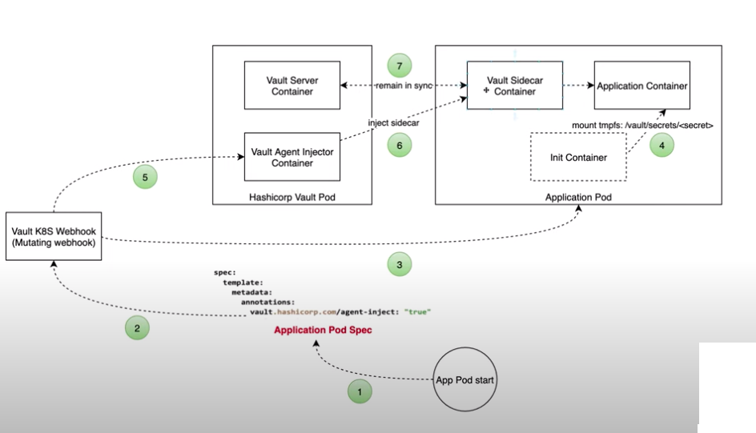

# Intro 
The purpose of this documemnt is to show how the DevOps cluster with the External Vault on Managment Cluster. We have followed this reference document  [Integrate a Kubernetes Cluster with an External Vault](https://learn.hashicorp.com/tutorials/vault/kubernetes-external-vault). 

# Key Steps 
On Vault Server (Management Cluster), 
- we have created a secret to be accessed by a sample app running on DevOps cluster. 
- enabled kubernetes authentication and KV secret engine (version 2)
- configured kubernetes authentication method to use a SA token (from the vault agent injector on DevOps cluster)
- created a policy with _read_ capacity. 
- created a kubernetes authentication role. We have created a vault role to provide access to app Service Account running in default namespace on DevOps cluster. 

On DevOps cluster 
- we have installed _vault agent injector_ via helm chart 
- used tolerations and nodeSelector parameter so that vault-agent-injector runs on Infra nodes. 
- deployed a pod with the required annotations. 
- added secret with ca certificate.

# Install and Configure Vault Agent Injector 

- Creating Project/Namespace and enable Cluster roleBinding

```
oc apply -f namespace.yaml
oc project vault
oc apply -f vault-role-binding.yaml
```

The roleBinding adds the clusterRole auth-delegator to the Service Account  _hashicorp-vault-agent-injector_. 

```
roleRef:
  apiGroup: rbac.authorization.k8s.io
  kind: ClusterRole
  name: system:auth-delegator
subjects:
- kind: ServiceAccount
  name: hashicorp-vault-agent-injector
  namespace: vault
```

- Add the Helm repo

```
helm repo add hashicorp https://helm.releases.hashicorp.com
helm repo update
```

- Installation of hashicorp-vault-agent-injector - install the Vault Helm chart configured to address an external Vault. 

`helm install -n vault hashicorp hashicorp/vault --version 0.18.0 -f vault/client-config.yaml`

The installation creates the SA hashicorp-vault-agent-injector. 

```
$ oc describe sa hashicorp-vault-agent-injector 
Name:                hashicorp-vault-agent-injector
Namespace:           vault
Labels:              app.kubernetes.io/instance=hashicorp
[openshift-service@AZUKS-RHACJPR01 repos]$ oc describe sa hashicorp-vault-agent-injector
Name:                hashicorp-vault-agent-injector
Namespace:           vault
Labels:              app.kubernetes.io/instance=hashicorp
                     app.kubernetes.io/managed-by=Helm
                     app.kubernetes.io/name=vault-agent-injector   
Annotations:         meta.helm.sh/release-name: hashicorp
                     meta.helm.sh/release-namespace: vault
Image pull secrets:  hashicorp-vault-agent-injector-dockercfg-vlp49
Mountable secrets:   hashicorp-vault-agent-injector-token-27cjr    
                     hashicorp-vault-agent-injector-dockercfg-vlp49
Tokens:              hashicorp-vault-agent-injector-token-27cjr    
                     hashicorp-vault-agent-injector-token-5sftc    
Events:              <none>
```

We took a note of the token _hashicorp-vault-agent-injector-token-gd9d8_  associated with the sa. This is used for k8s authentication. 

Tolerations

```  
tolerations: 
  - key: node.workload.openshift.io/infra
    effect: NoSchedule
    value: "true"
```

and nodeSelector 

```  
nodeSelector: 
    node-role.kubernetes.io/infra: ""
```

enables the vault-agenet-injector to run on Infra nodes. 
# Onboarding Applications to Vault 



We have onbaorded a sample Ruby application that is is now able to read secrets from the Enterprise Vault server hosted on Management cluster (https://vault.apps.management.balancing.nationalgrideso.com/). In order onboard our forst service, we followed a set of of steps. 

We have deployed the sample-app inside the _default_ namespace. The namespace of the app must be labelled properly for agent injector service to recognise the need for vault integration within the namespace.

```
Name:         default
Labels:       kubernetes.io/metadata.name=default
              openshift-pipelines.tekton.dev/namespace-reconcile-version=v1.5
              sidecar-injector=enabled
```
## Create secret on Vault Server 

Login to the Vault Server (on MGMT OCP Cluster) and created a secret 

`$ vault kv put secret/devwebapp/config username='giraffe' password='salsa'`

and verify that the secret is stored at the path secret/devwebapp/config.

`$ vault kv get -format=json secret/devwebapp/config | jq ".data.data"`

note: Use KV version 2.

## Configure Kubernetes Authentication 

Enable the Kubernetes authentication method. This needs to be done for the first time only. 

```
$ vault auth enable kubernetes
Success! Enabled kubernetes auth method at: kubernetes/
```

Vault accepts this service token from any client within the Kubernetes cluster. During authentication, Vault verifies that the service account token is valid by querying a configured Kubernetes endpoint. To configure it correctly requires capturing the JSON web token (JWT) for the service account, the Kubernetes CA certificate, and the Kubernetes host URL. See [Configure Kubernetes authentication](https://learn.hashicorp.com/tutorials/vault/kubernetes-external-vault) for further explanation. 

As per that doc, we collected the following the following values from the DevOps cluster 
- TOKEN_REVIEW_JWT
- KUBE_CA_CERT
- KUBE_HOST  and
- VAULT_HELM_SECRET_NAME

Finally, configure the Kubernetes authentication method to use the service account token, the location of the Kubernetes host, its certificate, and its service account issuer name. This one was carried out on the MGMT Vault server. 

```
$ vault write auth/kubernetes/config \
        token_reviewer_jwt="$TOKEN_REVIEW_JWT" \
        kubernetes_host="$KUBE_HOST" \
        kubernetes_ca_cert="$KUBE_CA_CERT" \
        issuer="https://kubernetes.default.svc.cluster.local"
```

For a Vault client to read the secret data defined in the Start Vault section requires that the read capability be granted for the path secret/data/devwebapp/config.

Write out the policy named devwebapp that enables the read capability for secrets at path secret/data/devwebapp/config

```
$ vault policy write devwebapp - <<EOF
path "secret/data/devwebapp/config" {
  capabilities = ["read"]
}
EOF
```

Create a Kubernetes authentication role named devweb-app.

```
vault write auth/kubernetes/role/devweb-app \
        bound_service_account_names=internal-app \
        bound_service_account_namespaces=default \
        policies=devwebapp \
        ttl=24h
```

## Injecting secrets into the Pod 

We have defined the following for the vault-agent-injector helm configuration 

```
namespaceSelector: 
    matchLabels:
      sidecar-injector: enabled
```

Hence, namespace of the app must be labelled properly for agent injector service to recognise the need for vault integration within the namespace.


The Vault Agent Injector only modifies a pod or deployment if it contains a specific set of annotations. Our sample pod definition contains the following annotations. 

```
  annotations:
    vault.hashicorp.com/agent-inject: "true"
    vault.hashicorp.com/role: 'devweb-app'
    vault.hashicorp.com/tls-skip-verify: "false"
    vault.hashicorp.com/tls-secret: vault-server-tls
    vault.hashicorp.com/ca-cert: /vault/tls/ca.crt
    vault.hashicorp.com/agent-inject-secret-credentials.txt: 'secret/data/devwebapp/config'
```


It's useful to give a reason for the annotations

**vault.hashicorp.com/agent-inject** - The Vault Agent Injector works by intercepting pod CREATE and UPDATE events in Kubernetes. The controller parses the event and looks for the metadata annotation vault.hashicorp.com/agent-inject: true. If found, the controller will alter the pod specification based on other annotations present.

**vault.hashicorp.com/role** -  is the Vault Kubernetes authentication role. We created this role devweb-app earlier  on Vault server. 

**vault.hashicorp.com/tls-skip-verify:** if true, configures the Vault Agent to skip verification of Vault's TLS certificate. It's not recommended to set this value to true in a production environment.

**vault.hashicorp.com/tls-secret** - name of the Kubernetes secret containing TLS Client and CA certificates and keys. This is mounted to /vault/tls. Since we have the above value as false, we need to add this value for the tls client and CA cert. 

**vault.hashicorp.com/ca-cert** - path of the CA certificate used to verify Vault's TLS. 

**vault.hashicorp.com/agent-inject-secret-FILEPATH** - prefixes the path of the file, credentials.txt written to the /vault/secrets directory. The value is the path to the secret defined in Vault.

Now, create the pod 

`oc apply --filename sample-app/pod-devwebapp-with-annotations.yaml`

The sample pod will be running on default namespace. 

```
$ oc get pods 
NAME                                     READY   STATUS    RESTARTS   AGE
devwebapp-with-annotations               2/2     Running   0          30h
```

The Vault Agent Injector service created an additional container in the pod that automatically writes the secrets to the _app_ container at the filepath _/vault/secrets/credentials.txt_.

Display the secrets written to the file _/vault/secrets/secret-credentials.txt_ on the devwebapp-with-annotations pod.

```
$ oc exec -it devwebapp-with-annotations -c app -- cat /vault/secrets/credentials.txt
data: map[password:salsa username:giraffe]
metadata: map[created_time:2022-01-15T16:51:38.228486946Z custom_metadata:<nil> deletion_time: destroyed:false version:1]
```


