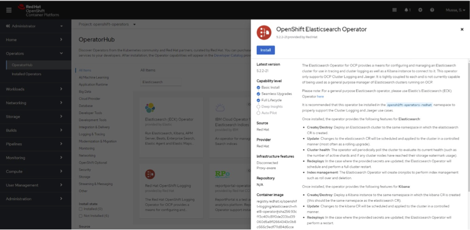
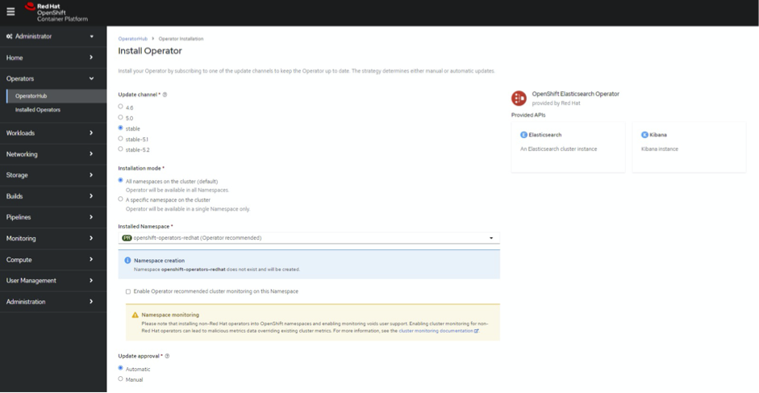
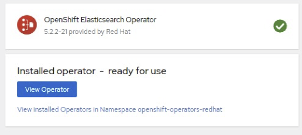

# OpenShift Elasticsearch Operator

Version – 5.2.2-21

1. Search operator

1. Click install

1. Check installation success by navigating to Operators – Installed operators (or click view operator below)

