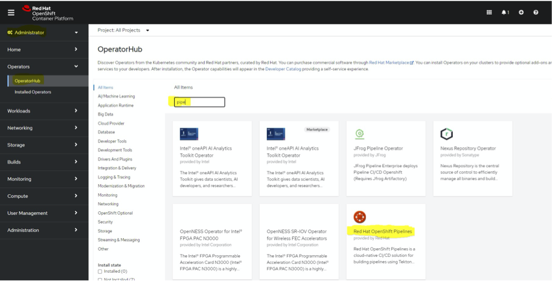
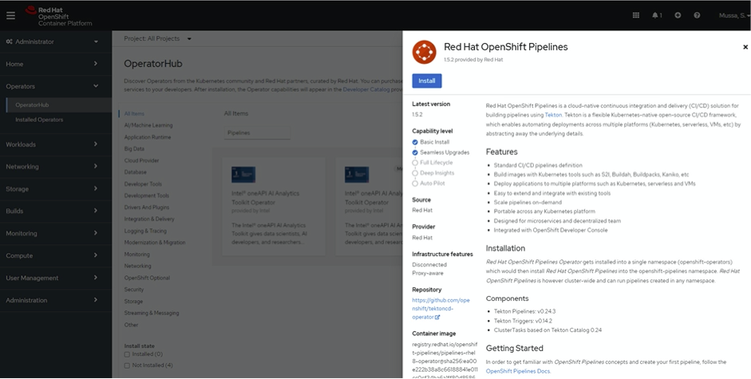
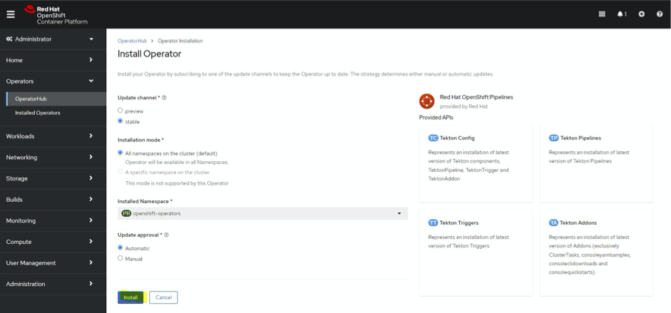
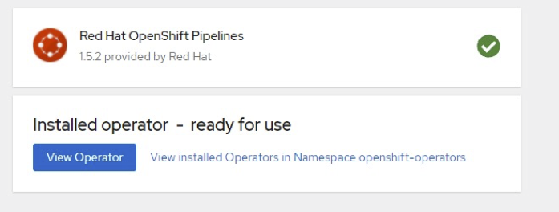

# Operators

## OpenShift pipeline operators

Version – 1.5.2

**Prerequisites**

1. Access a running OpenShift Container Platform cluster with administrative privileges. Developers can use [CodeReady Containers(CRC)](https://access.redhat.com/documentation/en-us/red_hat_codeready_containers/) to deploy a local OpenShift Container Platform cluster quickly.
2. Install [Tekton CLI](https://openshift.github.io/pipelines-docs/docs/0.10.5/proc_installing-cli.html) tkn on your local system and add it&#39;s location to your PATH environment variable.

Red Hat OpenShift Pipelines is a cloud-native continuous integration and delivery (CI/CD) solution for building pipelines using [Tekton](https://tekton.dev/). Tekton is a flexible Kubernetes-native open-source CI/CD framework, which enables automating deployments across multiple platforms (Kubernetes, serverless, VMs, etc) by abstracting away the underlying details.

**Install OpenShift pipeline operators**

1. Launch RedHat OCP console and View in admin mode – Navigate to operators – Operators Hub – Search for &quot;Pipelines&quot; – select the Redhat Opnshift Pipeline Operator from the list as shown below

1. Click on install

1. Specify below options and click install

1. Check installation success by navigating to Operators – Installed operators (or click view operator below)

## OpenShift pipeline operator vie CLI

1. Create a Subscription object YAML file to subscribe a namespace to the OpenShift Pipelines Operator, for example, 01.sub-pipeline.yaml

…\dso-pipeline-tooling\Operators\pipeline-tekton\01.sub-pipeline.yaml

1. Create the Subscription object:

oc appy -f 01.sub-pipeline.yaml

The OpenShift Pipelines Operator is now installed in the default target namespace openshift-operators