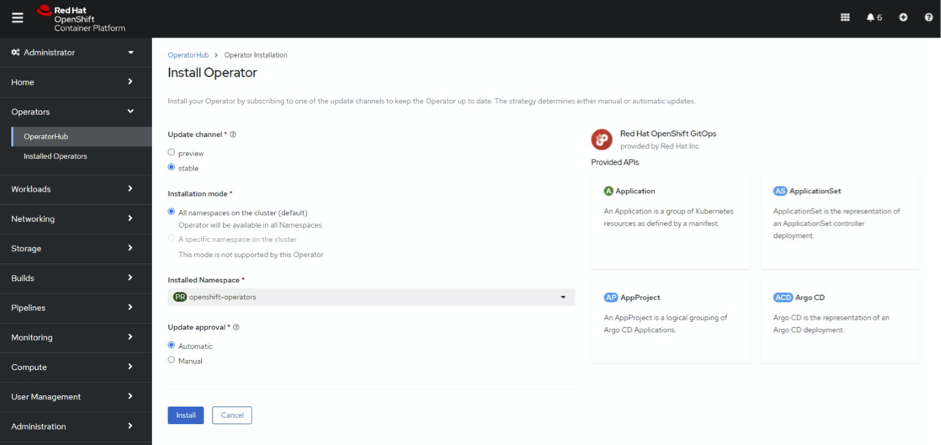
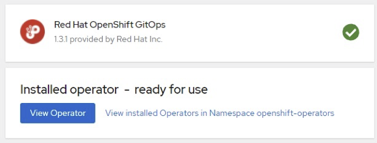

# argo cd

[Argo CD - Declarative GitOps CD for Kubernetes](https://argo-cd.readthedocs.io/en/stable/)

Application definitions, configurations, and environments should be declarative and version controlled. Application deployment and lifecycle management should be automated, auditable, and easy to understand.

ArgoCD is a declarative continuous delivery tool that leverages GitOps to maintain cluster resources. ... ArgoCD enables you to deliver global custom resources, like the resources that are used to configure OpenShift Container Platform clusters

## Installation

Use the OpenShift console, run the following command:

```bash
oc apply -f 01.sub-gitops.yaml
```

## Usage

```python
........
```

## Contributing
Pull requests are welcome. For major changes, please open an issue first to discuss what you would like to change.

Please make sure to update tests as appropriate.

## License
[MIT](https://choosealicense.com/licenses/mit/)

# OpenShift GitOps Operator  (ArgoCD)

Version – 0.0.15

1. Click on install


1. Click on  install



1. Check installation success by navigating to Operators – Installed operators (or click view operator below)



   OpenShift GitOps operator vie CLI

1. Create a Subscription object YAML file to subscribe a namespace to the OpenShift Pipelines Operator, for example, 01.sub-gitops.yaml

…\dso-pipeline-tooling\Operators\ gitops-argocd \ 01.sub-gitops.yaml

1. Create the Subscription object:

oc appy -f 01.sub-gitops.yaml

The OpenShift Pipelines Operator is now installed in the default target namespace openshift-operators


